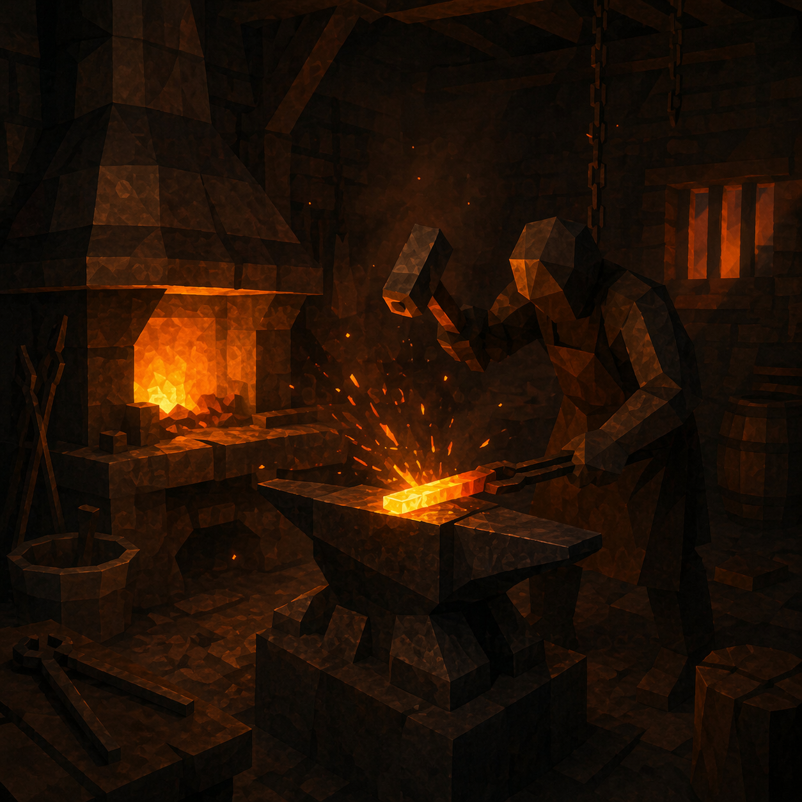
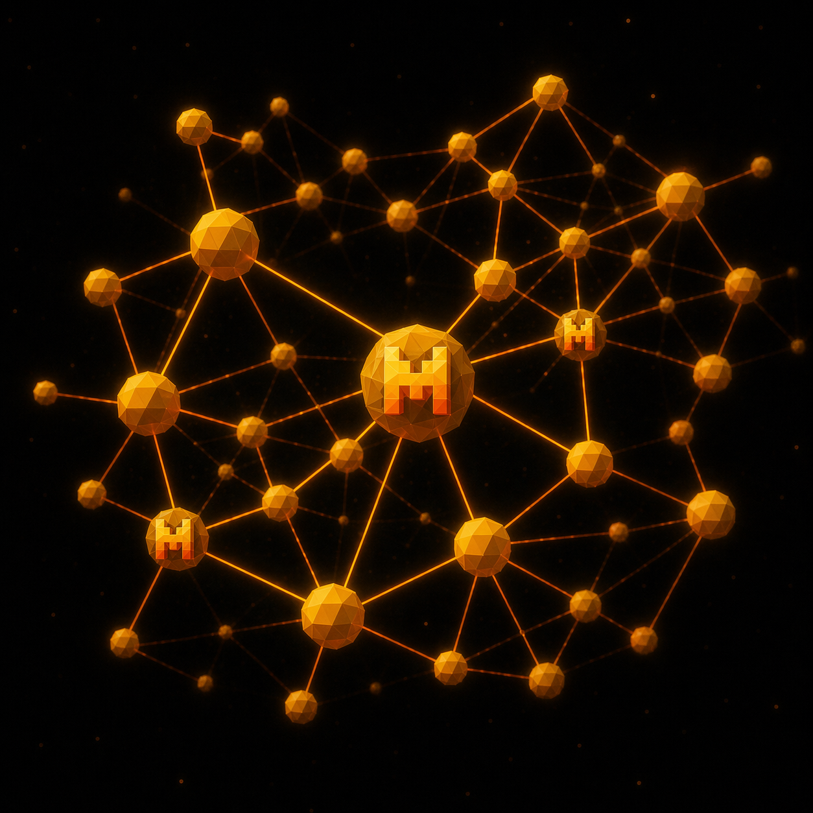
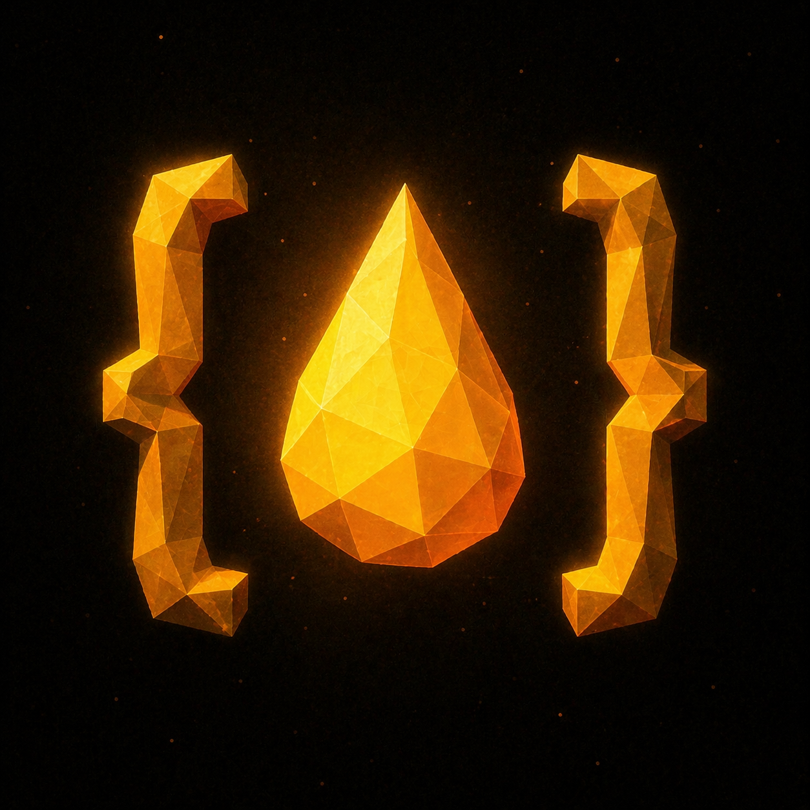

<!-- BANNER -->
<div align="center">
  
</div>

<!-- TAGLINE -->
<div align="center">
  
</div>

<br/>

## `> whoami`

```txt
dayan decamp — paris, france
cloud consultant  ·  azure  ·  aws  ·  gcp  ·  blue prism
automation & ai   ·  claude code + mcp tooling
indie gamedev     ·  godot
side quests       ·  image + video gen
aliases           ·  swih  ·  zoplop
```

<br/>

## `> stack`

<table>
  <tr>
    <td><b>&nbsp;CLOUD&nbsp;</b></td>
    <td>
      
      &nbsp;
      
      &nbsp;
      
      &nbsp;
      
      &nbsp;
      
      &nbsp;
      
      &nbsp;
      
    </td>
  </tr>
  <tr>
    <td><b>&nbsp;AUTOMATION&nbsp;</b></td>
    <td>
      
      
      
      
    </td>
  </tr>
  <tr>
    <td><b>&nbsp;AI / AGENTS&nbsp;</b></td>
    <td>
      
      
      
      
      &nbsp;
      
    </td>
  </tr>
  <tr>
    <td><b>&nbsp;BUILD&nbsp;</b></td>
    <td>
      
      &nbsp;
      
      &nbsp;
      
      &nbsp;
      
      &nbsp;
      
      &nbsp;
      
      &nbsp;
      
    </td>
  </tr>
</table>

<br/>

## `> now building`

<table>
  <tr>
    <td width="50%" valign="top" align="center">
      <a href="https://github.com/Swih/godot-foundry">
        
      </a>
      <h3>🏗 <a href="https://github.com/Swih/godot-foundry">godot-foundry</a></h3>
      <p align="left">Multi-agent game dev studio for <b>Godot Engine</b>, powered by <b>Claude Code</b>. 15 specialized agents. Built for solo devs who ship.</p>
      <p>
        
        
        
      </p>
    </td>
    <td width="50%" valign="top" align="center">
      <a href="https://github.com/Swih/mistral-mcp">
        
      </a>
      <h3>🤖 <a href="https://github.com/Swih/mistral-mcp">mistral-mcp</a></h3>
      <p align="left">MCP server exposing <b>Mistral AI</b> models to any MCP client. Drop-in for Claude Desktop, Claude Code, Cursor and other MCP-aware tooling.</p>
      <p>
        
        
        
      </p>
    </td>
  </tr>
  <tr>
    <td width="50%" valign="top" align="center">
      <a href="https://github.com/Swih/decant-extension">
        
      </a>
      <h3>💧 <a href="https://github.com/Swih/decant-extension">decant-extension</a></h3>
      <p align="left">Extract clean <b>Markdown</b>, JSON or MCP from any web page. Chrome Extension + MCP Server.</p>
      <p>
        
        
      </p>
    </td>
    <td width="50%" valign="top" align="center">
      <a href="https://github.com/Swih/whiskcam-headless">
        
      </a>
      <h3>🛒 <a href="https://github.com/Swih/whiskcam-headless">whiskcam-headless</a></h3>
      <p align="left">Headless <b>Shopify</b> storefront on <b>Next.js App Router</b>. Production-grade commerce template.</p>
      <p>
        
        
      </p>
    </td>
  </tr>
</table>

<br/>

## `> stats`

<div align="center">


</div>

<br/>

<div align="center">
  
</div>

<br/>

## `> contributions`

<div align="center">
  
</div>

<br/>

## `> connect`

<p align="left">
  <a href="https://www.linkedin.com/in/dayan-decamp/"></a>
  <a href="mailto:dayan.decamp.pro@gmail.com"></a>
  
  <a href="https://github.com/Swih"></a>
</p>

<br/>

<div align="center">
  <sub><code>// now loading ...</code></sub>
  <br/><br/>
  
</div>
